# Auftakt

## Willkommen

Schön, dass du dabei bist ​🙂​

Die nächsten **8 Tage** arbeiten wir in dieser Arbeitsgruppe an der Schnittstelle von
 **Maschinellen Lernen**, **Statistik** und **Kausaler Inferenz**.

::: {.fragment}
> Wir untersuchen nicht nur, welche Korrelationen Daten enthalten, sondern wann diese Muster etwas über **Ursache und Wirkung** aussagen.

Wir werden zunächst zusammen die Grundlagen erarbeiten und dann in Gruppenprojekten vertiefen.
:::


::: {.notes}
0–3 Minuten. Zuerst nur die Beobachtung vorlesen und zehn Sekunden raten lassen: „Was könnte hier passiert sein?“ Erst nach zwei oder drei Wortmeldungen weiterschalten. Die Grafik wechselt dann zur gemeinsamen Ursache Alkohol. Leitidee: Ein auffälliges Muster genügt nicht für eine Ursache.
:::

## Heute

| Programmpunkt | Format | Frage |
|---|---:|---|
| 1 | Ankommen & Orientierung | Wer sind wir, was ist diese AG? |
| 2 | Vorstellungsrunde | Welche Erfahrungen und Erwartungen sind im Raum? |
| 3 | Motivationsbeispiele | Wann täuscht Korrelation? |
| 4 | Gruppenarbeit & Projekte | Wie arbeiten wir in den nächsten Tagen? |

::: {.notes}
Diese Folie ist die Taktung für die Dozierenden. Bei großer Gruppe die Vorstellungsrunde straff halten und den vierten Forschungsfall als Backup behandeln.
:::

# Die Arbeitsgruppe

## Das sind wir

:::: {.columns}

::: {.column width="48%"}

### Dr. Oliver Schacht

{fig-alt="Portrait von Oliver" height="190"}

- Promotion in Statistik / **Causal Machine Learning**
- Arbeiten u.a. zum Einsatz kausaler KI in der Halbleiterfertigung
- Mitwirkung am Python-Paket **DoubleML**
- Erfahrung im Data Science Consulting bei Economic AI

:::

::: {.column width="48%"}

### Jan Teichert-Kluge

{fig-alt="Portrait von Jan" height="190"}

- Promotion in Statistik / **Causal Machine Learning**
- Arbeiten u.a. zu Kausaler Inferenz mittels Deep Learning
- Mitwirkung am Python-Paket **DoubleML**
- Langjährige Industrie-Erfahrung in Data-Science-Teams

:::

::::

## Inhalte der Arbeitsgruppe

* Die AG behandelt die Grundlagen der kausalen Inferenz (mit ML)

  * Zentrale Konzepte der kausalen Inferenz:
    * Potenzielle Outcomes und kontrafaktische Szenarien
    * Definition kausaler Effekte
    * Grafische Modelle
  * Statistische Methoden zur Untersuchung von Kausalität:
    * Randomisierte Experimente
    * Beobachtungsstudien
    * Identifikation kausaler Effekte
    * Schätzung mit ML

## Lernziele der Arbeitsgruppe

* Wir wollen methodische Skills vermitteln, die in Studium, Beruf und Forschung hilfreich sein werden, z.B.,

  * wie man allgemeine Intuitionen auf eine handhabbare Weise formalisiert
  * wie man Hypothesen ableitet, die anhand von Daten getestet werden können
  * problemorientiertes und selbstorganisiertes Lernen
  * die Fähigkeit, Assoziation von Kausalität zu unterscheiden – sehr wichtig für Ihr ganzes Leben! 🙂​


## Gemeinsame vs. Gruppenarbeit

:::: {.columns}

::: {.column width="48%"}

### Gemeinsam

- Grundlagen zu ML und Kausalinferenz
- technische Unterstützung: Python, VS Code und Streamlit
- Vorstellung und Diskussion der Gruppenprojekte

:::

::: {.column width="48%"}

### In den Gruppen

- ein Vertiefungsthema eigenständig erschließen
- eine kausale Fragestellung inkl. Annahmen, Schätzung usw. beantworten
- eine kleine interaktive App oder Analyse bauen
- Annahmen, Grenzen und offene Fragen sichtbar machen

:::

::::

::: {.callout-important appearance="simple"}
Uns geht es nicht um eine Referatsreihe. Die Gruppenarbeiten sind ein Labor. 
Es geht darum mit Daten und Methodiken zu arbeiten und dabei zu lernen!
:::

::: {.callout-important appearance="simple"}
Die abschließenden Präsentationen sind keine Prüfungen! Sie sind Anregungspunkt für Diskussionen.
:::

## Wer seid ihr?

Wir wollen euch kennenlernen, z.B.,

- Name, Studienfach
- Ein Thema, das dich wissenschaftlich beschäftigt
- Was du gerne im Rahmen der Arbeitsgruppe verstehen würdet

::: {.callout-tip appearance="simple"}
Bist du schonmal auf einen Trugschluss durch Korrelationen gestoßen?
:::

::: {.notes}
10–20 Minuten. Eine sichtbare Uhr hilft. Nach etwa zwölf Minuten aktiv schließen und ankündigen, dass Fachinteressen beim Projektmatching wieder aufgegriffen werden.
:::

## Positionsbarometer

Stellt euch gemäß eurer Position im Raum auf.

| Linkes Ende | Rechtes Ende |
|---|---|
| stimme gar nicht zu | stimme voll zu |

Aussagen:

::: {.fragment}
1. „Ein sehr gutes ML-Modell liefert automatisch gute Entscheidungen.“ 
::: 
::: {.fragment}
2. „Kausalität ist vor allem gesunder Menschenverstand.“
:::
::: {.fragment}
3. „Je größer Modell und Datenmenge, desto besser wird der Output.“
:::

::: {.notes}
20–25 Minuten. Nach jeder Aussage zwei kontrastierende Stimmen einholen, nicht auflösen. Die Aussagen werden im Verlauf der Woche präziser.
:::

# Warum das „Warum“ zählt

## Schokolade als Nobelstrategie?

:::: {.columns}

::: {.column width="43%"}

> Länder mit höherem Schokoladenkonsum haben mehr Nobelpreisträger:innen pro Kopf.

::: {.fragment}
::: {.callout-note appearance="simple"}
**Mögliche Diagnose: Confounding.** Wohlstand, Bildungs- und Forschungsinfrastruktur erhöhen plausibel sowohl den Schokoladenkonsum als auch die Chance auf wissenschaftliche Spitzenleistungen.
:::
:::

:::

::: {.column width="57%"}

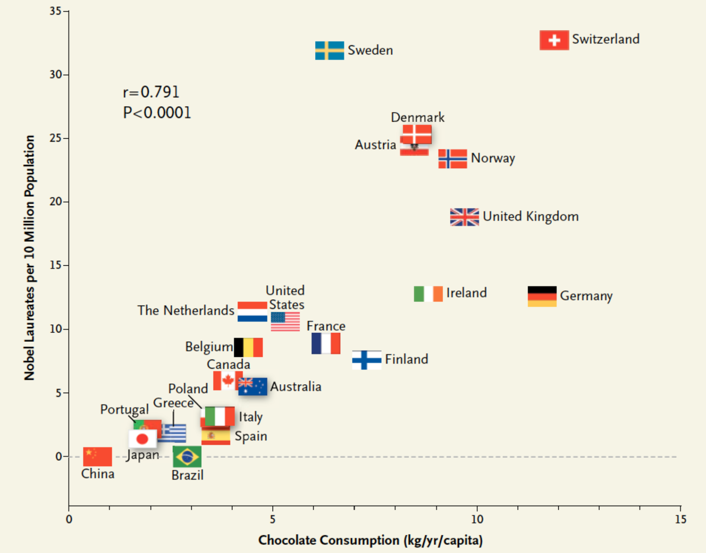{fig-alt="Positive Korrelation zwischen Schokoladenkonsum und Nobelpreisträgerinnen und Nobelpreisträgern pro Kopf." height="375"}

:::

::::


## Attraktivität schlägt auf den Charakter?

:::: {.columns}

::: {.column width="43%"}

> Auf einer Dating-Plattform erhalten sehr attraktive Profile kürzere, weniger persönliche Nachrichten.

::: {.fragment}
::: {.callout-note appearance="simple"}
**Mögliche Diagnose: Selektions- bzw. Colliderbias.** Wer nur Menschen auf Datingapps betrachtet, konditioniert auf einen Auswahlprozess. Diese Teilmenge liefert nicht zwangsläufig valide Schlüsse auf die Population.
:::
:::

:::

::: {.column width="57%"}

<div style="height: 330px; overflow: hidden;">
  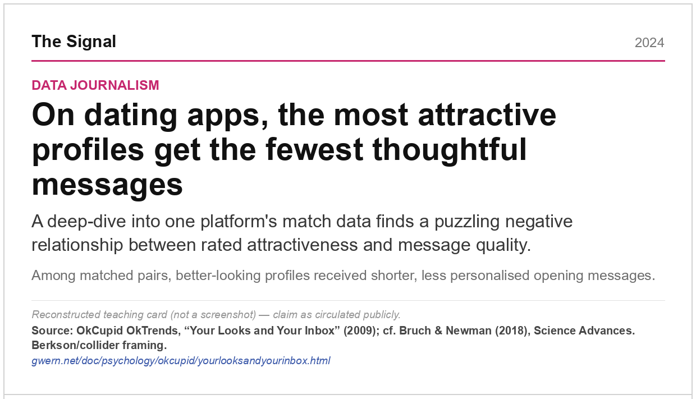
</div>

:::

::::

## KI und Geisteswissenschaftsabschlüsse

:::: {.columns}

::: {.column width="43%"}

> Die weltweite Verbreitung von KI und die Zahl der Geisteswissenschaftsabschlüsse verlaufen fast parallel.

::: {.fragment}
::: {.callout-note appearance="simple"}
**Mögliche Diagnose: Scheinkorrelation.** Eine gemeinsame Zeitachse kann sehr unterschiedliche Größen gleichzeitig verändern. Ohne plausiblen Wirkmechanismus und Vergleichsdesign ist die fast perfekte Korrelation keine Evidenz für einen Effekt.
:::
:::

:::

::: {.column width="57%"}

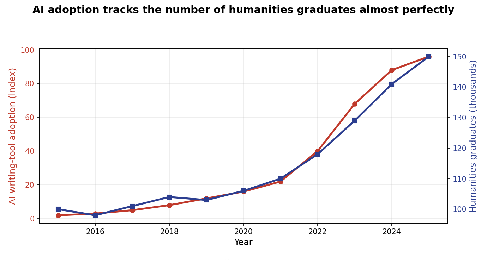{fig-alt="Zwei stark ähnlich verlaufende Zeitreihen."}

:::

::::

## Der Mindestlohn macht alles teuerer!!11!

:::: {.columns}

::: {.column width="40%"}

> Nach einer Mindestlohnerhöhung steigen auch die Preise für Brot und Brötchen.

::: {.fragment}
::: {.callout-note appearance="simple"}
**Mögliche Diagnose: gemeinsame Trends und Rückkopplung.** Lebenshaltungskosten, Branchenkosten und politische Reaktionen können Löhne und Preise zugleich bewegen. Ein glaubwürdiger Vergleich könnte etwa ein **Difference-in-Differences**-Design nutzen.
:::
:::

:::

::: {.column width="60%"}

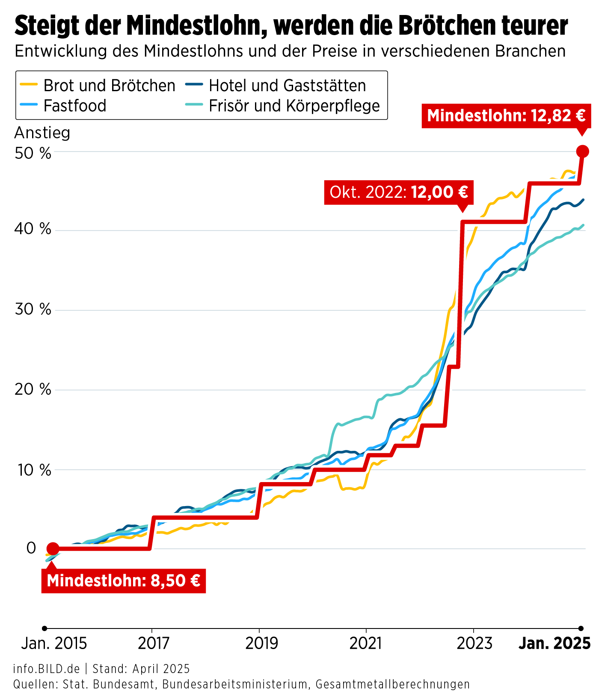{fig-alt="Grafik zur Entwicklung von Mindestlohn und Preisen in mehreren Branchen." height=500}

:::

::::

## Wein als heimlicher Covid Impfstoff?

:::: {.columns}

::: {.column width="45%"}

> In Beobachtungsdaten scheint regelmäßiger Weinkonsum mit einem niedrigeren COVID-Risiko einherzugehen.

::: {.fragment}
::: {.callout-note appearance="simple"}
**Mögliche Diagnose: Confounding.** Alter, Einkommen, Gesundheit, Zugang zu Versorgung und Kontaktverhalten können sowohl den Konsum von Wein als auch das Erkrankungsrisiko beeinflussen.
:::
:::

:::

::: {.column width="55%"}

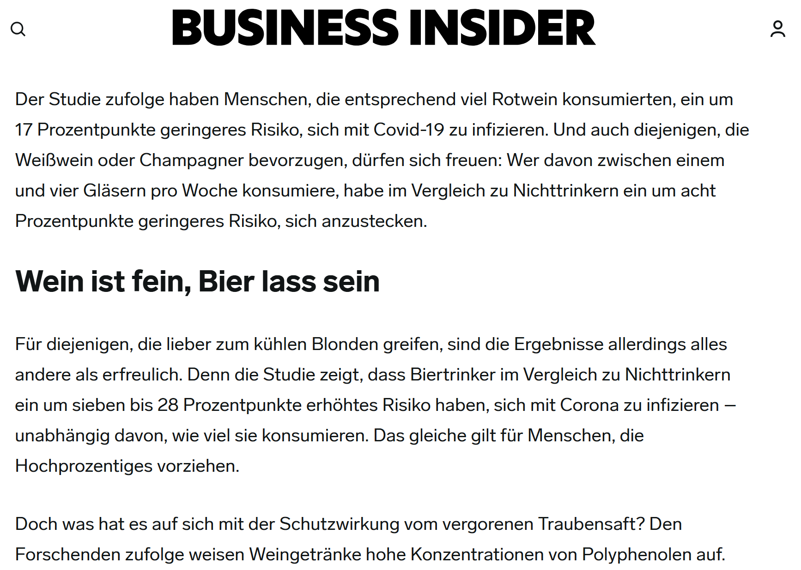{fig-alt="Lehrillustration zu Wein als scheinbarem Schutzfaktor gegen COVID."}

:::

::::

## Krankenhausaufenthalte machen krank?

:::: {.columns}

::: {.column width="43%"}

> Patient:innen mit langen Krankenhausaufenthalten haben später im Mittel einen schlechteren Gesundheitszustand.

::: {.fragment}
::: {.callout-note appearance="simple"}
**Mögliche Diagnose: umgekehrte Kausalität.** Häufig macht nicht der Aufenthalt krank; ein schwerer Ausgangszustand führt zugleich zu längerer Verweildauer und schlechterer späterer Gesundheit.
:::
:::

:::

::: {.column width="57%"}

<div style="overflow: hidden;">
  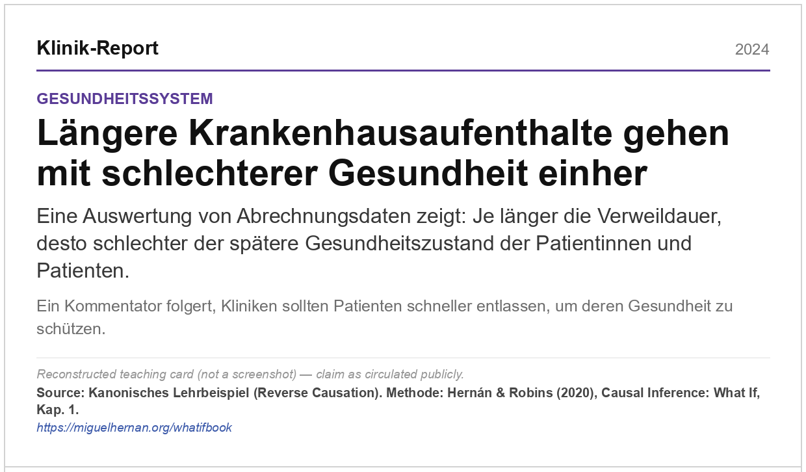
</div>

:::

::::

## Ausgebuchte Unterkünfte, schmerzende Augen

:::: {.columns}

::: {.column width="30%"}

> Regionen mit vielen ausgebuchten Airbnbs verzeichnen zugleich auffällig viele Suchanfragen nach „Augenschmerzen“.

::: {.fragment}
::: {.callout-note appearance="simple"}
**Mögliche Diagnose: gemeinsame Ursache.** Die Sonnenfinsternis vom 8. April 2024 brachte Reisende auf ihren Verlauf und führte zugleich zu mehr Suchanfragen nach Beschwerden rund um das Beobachten der Finsternis.
:::
:::

:::

::: {.column width="70%"}

::: {layout-ncol=2 layout-valign="center"}
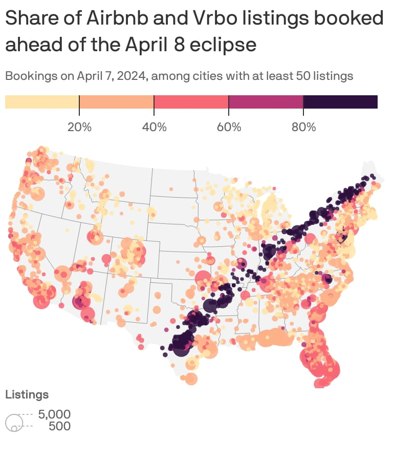{fig-alt="Karte zu Airbnb- und Vrbo-Buchungen entlang des Verlaufs der Sonnenfinsternis."}

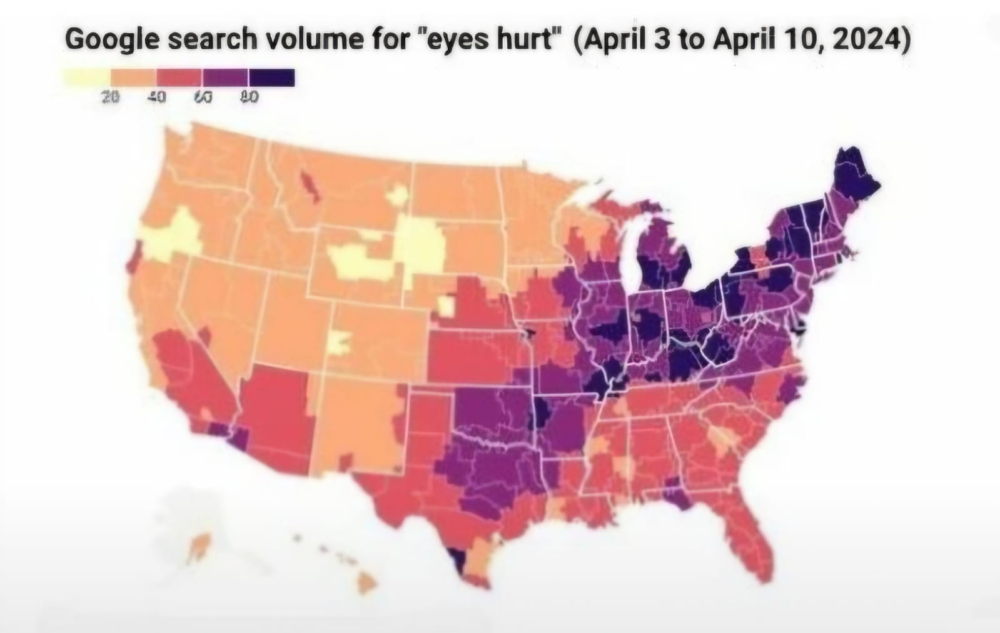{fig-alt="Karte zum Suchvolumen für Augenbeschwerden in den USA."}
:::

:::

::::

## Covid Booster und Sterblichkeitsraten

:::: {.columns}

::: {.column width="43%"}

> In den Gesamtdaten ist die Sterblichkeit unter den geboosterten Patient:innen höher.

::: {.fragment}
::: {.callout-note appearance="simple"}
**Mögliche Diagnose: Simpsons Paradox.** Wenn Geboosterte im Schnitt deutlich älter sind, dominieren sie in den Rohdaten. Innerhalb jeder Altersgruppe kann die Sterblichkeit dennoch niedriger sein; erst die Altersstandardisierung macht den Vergleich sinnvoll.
:::
:::

:::

::: {.column width="57%"}

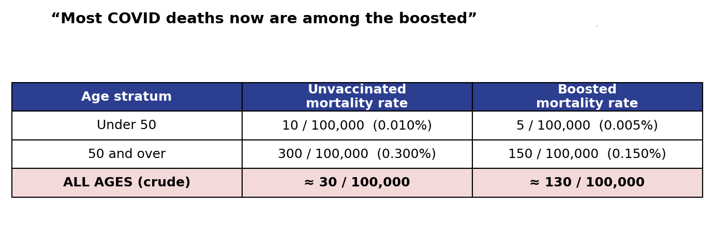{fig-alt="Tabelle mit Sterblichkeitsraten nach Impfstatus und Altersgruppe"}
:::

::::


## Vom Muster zum Argument

::: {.incremental}
- **Kausale Frage**  
  Welchen Effekt wollen wir ermitteln?

- **Counterfactual**  
  Was wäre sonst geschehen?

- **Design, Annahmen & Identifikation**  
  Warum ist der Vergleich glaubwürdig?

- **Schätzung**  
  Welche Schätzgröße folgt aus den Daten?

- **Interpretation**  
  Was zeigt sie, und was nicht?
:::

::: {.fragment}
::: {.callout-note appearance="simple"}
Ein (ML-)Modell kann eine Zahl ausgeben. Eine kausale Analyse muss zusätzlich begründen, warum diese Zahl als kausaler Effekt interpretiert werden darf.
:::
:::

# Die nächsten Tage

## Ablaufplan

```{mermaid}
flowchart LR
  A["19.08.<br/>Auftakt & Setup"] --> B["20.08.<br/>ML & Kausalinferenz"]
  B --> C["21.–22.08.<br/>Projekt-Sprint"]
  C --> D["24.–25.08.<br/>Gruppenpräsentationen"]
  D --> E["26.08.<br/>Synthese & Feedback"]
```

- Heute setzen wir noch zusammen Python auf und erkunden Streamlit.
- Morgen gibt es interaktive Input Sessions zu ML und kausaler Inferenz
- Am 21.08. und 22.08. ist Zeit für die Gruppenarbeit
- Am 23.08. ist frei; die Präsentationen verteilen sich auf den 24. und 25.08.

::: {.notes}
35–38 Minuten. Die genauen Uhrzeiten stehen auf der Ablaufplan-Seite; hier nur den Rhythmus zeigen: Grundlagen → Gruppenarbeit → gegenseitiges Lernen → Synthese.
:::

## Themen der Gruppenarbeit

:::: {.columns}

::: {.column width="50%"}

| Thema | Kernfrage |
|---|---|
| 🏥 **Randomisierte Experimente / Medizin** | Was leistet ein RCT? |
| 🔍 **Explainable ML / AI** | Warum sind Modell-Erklärungen nicht automatisch kausal? |
| 💬 **Causality and LLMs** | Können Sprachmodelle kausal schlussfolgern? |
| 🕸️ **DAGs / Causal Discovery** | Welche Strukturannahmen lassen sich begründen oder aus Daten eingrenzen? |

:::

::: {.column width="50%"}

| Thema | Kernfrage |
|---|---|
| 🎯 **Causal Inference with ML** | Für wen wirkt eine Maßnahme — und wie hilft ML? |
| 📐 **Tools: RDD / DiD** | Was lernen wir aus Cutoffs, und parallelen Trends? |
| 🎲 **Bayesian Methods** | Wie werden Vorwissen und Unsicherheit transparent modelliert? |


::: {.callout-tip appearance="simple"}
Die Website liefert zu jedem Thema einen Einstieg, eine Demo und offene Fragen. Das Projekt beginnt nicht mit einer fertigen Antwort, sondern mit einer guten Entscheidung darüber, **was ihr zeigen wollt**.
:::

:::

::::


## Themengestaltung

Euer Thema setzt den Rahmen. Euer Projekt nimmt darin **eine** Frage ernst.

> Nicht: „Wir erklären unser gesamtes Themengebiet.“
>
> Sondern: „Wir untersuchen an einem klaren Beispiel, wann eine Idee oder Methode trägt — und wo ihre Grenze liegt.“

::: {.callout-tip appearance="simple"}
Eine gute Forschungsfrage passt in **einen Satz**. Sie ist wissenschaftlich oder praktisch interessant, aber klein genug, um sie mit Daten, einem Experiment oder einer Simulation wirklich zu untersuchen.
:::

## Ein Projekt ist ein Forschungsargument

| Baustein | Was dazu gehört |
|---|---|
| **Frage & Motivation** | eine präzise, nicht triviale Forschungsfrage |
| **Konzept & Annahmen** | die zentrale Idee und was gelten muss, damit eine Aussage trägt |
| **Setup** | Daten, Replikation, Benchmark, eigenes Experiment oder Simulation |
| **Interaktive Analyse** | eine Variation, die etwas zum Vorschein bringt |
| **Findings & Grenzen** | eine ehrliche Erkenntnis — und was daraus ausdrücklich nicht folgt |

::: {.callout-important appearance="simple"}
Eine Methode auszuführen oder eine Zahl zu berechnen reicht nicht. Das Ergebnis soll interaktiv sein!
:::

## Die App macht eine Idee erfahrbar

Eine statische Folie kann ein Ergebnis zeigen. In eurer App sollen andere selbst untersuchen können, was sich verändert, wenn sie zum Beispiel

- eine Annahme oder einen Parameter verändern,
- zwei Modelle oder Auswertungen vergleichen,
- eine Datenstruktur, einen Prior, Cutoff oder Prompt variieren.

> **Leitfrage:** Was können andere durch die Interaktion verstehen, was auf einer statischen Folie unsichtbar bliebe?

Eine kleine, präzise App ist besser als ein großes Dashboard ohne klare wissenschaftliche Aussage.

## Vier Arbeitsblöcke

| Block | Tag | Ziel am Ende |
|---|---|
| **1 · Scope & Design** | Freitag morgens | Frage, Konzept, Setup |
| **2 · Analyse** | Freitag vormittags | Kernanalyse, erste Visualisierung |
| **3 · Streamlit & Story** | Samstag morgens | Interaktion, Erklärung, Findings  |
| **4 · Finalisierung** | Samstag vormittags | Prototyp der App |

::: {.callout-note appearance="simple"}
Erst muss das wissenschaftliche Argument funktionieren. Danach wird daraus eine gute App.
:::

## Wir sind dazu helfen!

- Sowohl inhaltlich als auch technisch, wir arbeiten zusammen 
- Es geht darum ein Verständnis von Materie und Methodik zu bekommen

# Kennenlernen in den Teams

## Team-Auftakt

1. **Kurz kennenlernen (falls noch nicht geschehen)** 
2. **Erste Ideen austauschen**
3. **Erste Skizze festhalten**

::: {.notes}
47–55 Minuten. Es geht bewusst nicht um eine endgültige Projektentscheidung. Die Gruppen sollen sich kennenlernen, ihre Vorarbeit sichtbar machen und mit einem gemeinsamen Startpunkt in den späteren Kick-off gehen. Bei der Runde herumgehen und nachfragen: „Was wäre eine kleine, untersuchbare Frage innerhalb eures Themas?“
:::

## Eure erste Skizze

Haltet am Ende auf einer Karte oder in einer gemeinsamen Notiz fest:

1. **Wir möchten verstehen:** „…“
2. **Dafür wäre ein gutes Beispiel / Setup:** „…“
3. **Diese Annahme oder Frage müssen wir noch klären:** „…“

::: {.callout-note appearance="simple"}
Wenn ihr schon eine starke Idee vorbereitet habt, nutzt die Runde als *Stress-Test*: Ist die Frage eng genug? Und ist schon erkennbar, was andere später mit der App selbst herausfinden können?
:::

# Abschluss

## Neugierig geworden?

Quellen für entspanntes Lernen über kausales ML

:::: {.columns}

::: {.column width="76%"}
**Schauen:** [Brady Neal: *Introduction to Causal Inference*](https://www.bradyneal.com/causal-inference-course/)

Videoreihe mit Kursmaterialien, kurze Videos, verfügbar auf Youtube.
:::

::: {.column width="24%"}
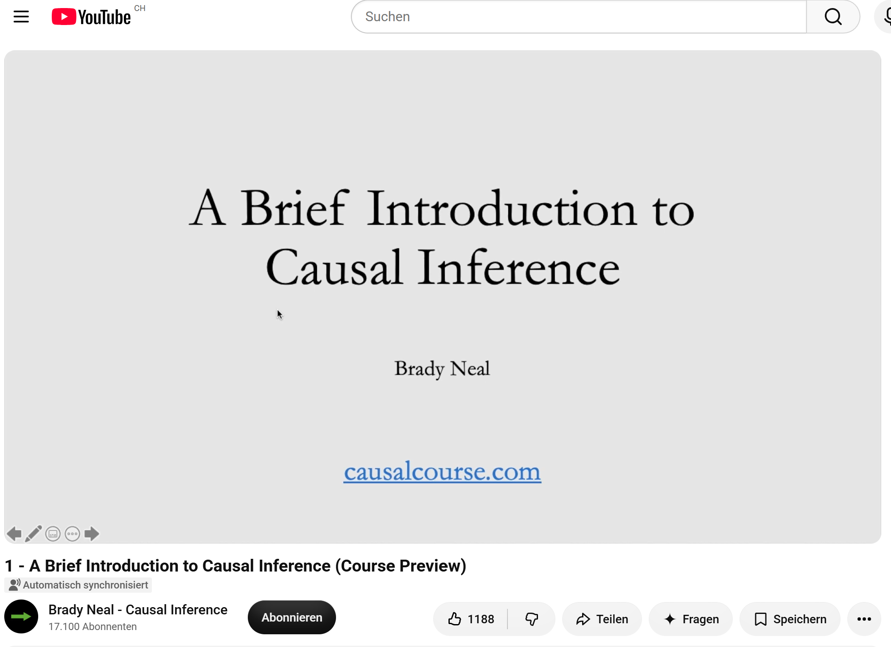{fig-alt="Vorschaubild der Videoreihe Introduction to Causal Inference von Brady Neal." height="85"}
:::

::::

:::: {.columns}

::: {.column width="76%"}
**Hören:** [Causal Bandits Podcast](https://causalbanditspodcast.com/)

Vorstellung von aktuellen Forschungsthemen rund um Kausalität und Causal AI.
:::

::: {.column width="24%"}
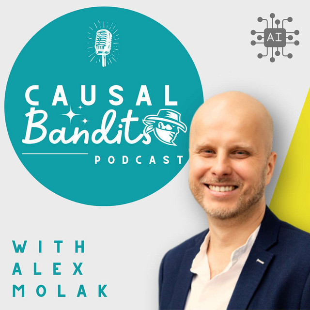{fig-alt="Cover des Causal Bandits Podcast." height="85"}
:::

::::

:::: {.columns}

::: {.column width="76%"}
**Lesen:** [*Causal Inference: The Mixtape*](https://mixtape.scunning.com/)

Gut zugängliche Online-Einführung mit vielen anwendungsnahen Geschichten und Methoden.
:::

::: {.column width="24%"}
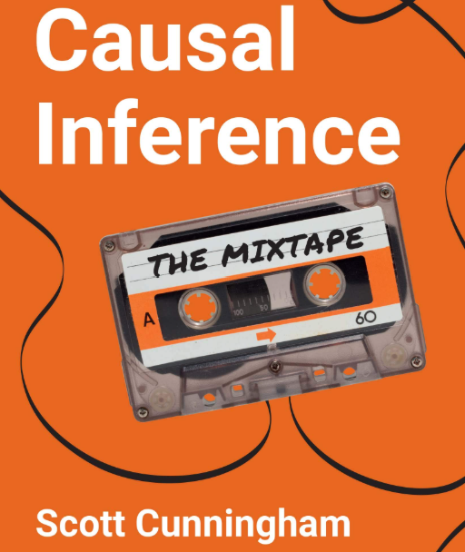{fig-alt="Cover von Causal Inference: The Mixtape." height="85"}
:::

::::


## Kurze Pause

Danach geht es mit dem gemeinsamen **Python-Setup** weiter.
