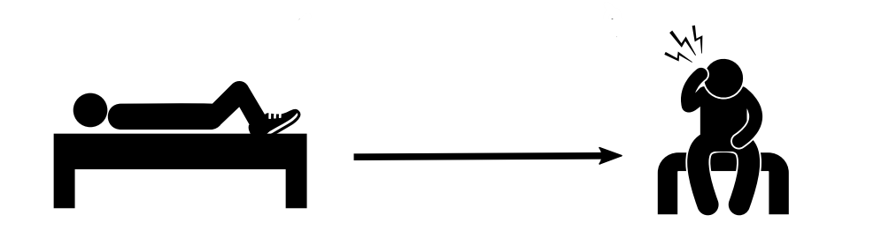
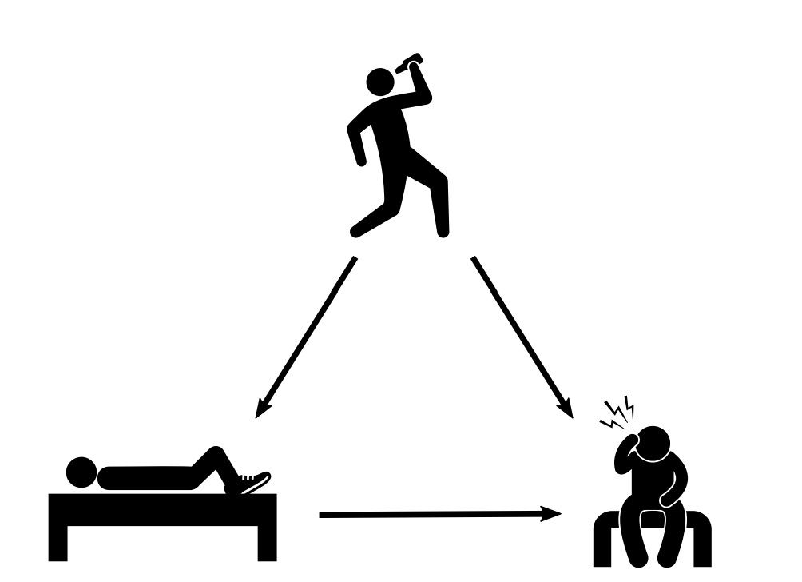
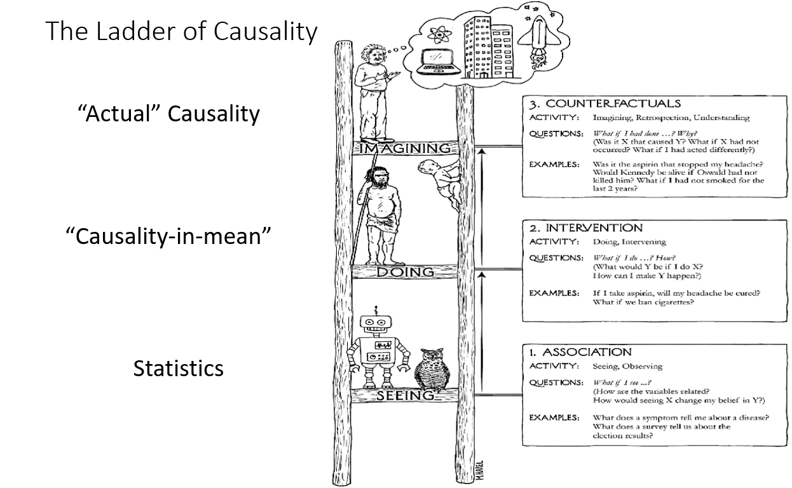
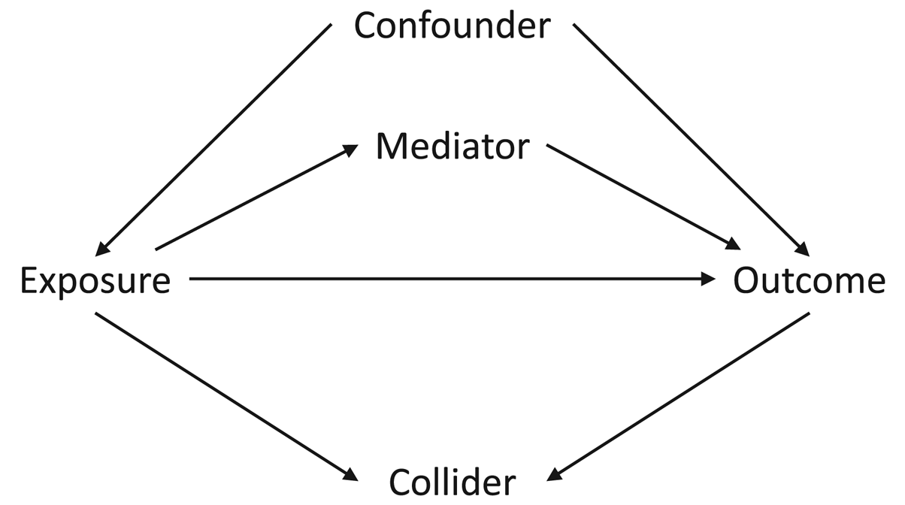

# Einstieg

## Hat wer mit Schuhen geschlafen?

:::: {.columns}

::: {.column width="48%"}

> Na: Wer hat gestern am ersten Abend schon mit Schuhen im Bett geschlafen?

Menschen, die mit Schuhen einschlafen, berichten auffällig oft Kopfschmerzen am nächsten Morgen.

::: {.fragment}
**Verursachen Schuhe im Bett Kopfschmerzen?**
:::

:::

::: {.column width="52%"}

<div style="position: relative; height: 340px; width: 100%;">
  
  
</div>

<small>Grafik: [Brady Neal, *Causal Inference from a Machine Learning Perspective*](https://www.bradyneal.com/causal-inference-course#course-textbook/)</small>

:::

::::

::: {.notes}
Zeit: 0–4 Minuten. Als lockeren Rückbezug auf den ersten Abend fragen; keine persönlichen Antworten einfordern. Dann die Beobachtung zeigen und zwei oder drei plausible Vermutungen sammeln. Erst weiterklicken: Alkohol ist eine gemeinsame Ursache für Schuhe im Bett und Kopfschmerzen. Die Vorlesung liefert die präzise Sprache dafür, warum die erste Assoziation kein Effekt ist.
:::


## Ziel dieser Einführung 🎯

- Gestern haben wir verschiedene kausale Fragestellungen und Biases **qualitativ** beschrieben.
- Heute schauen wir darauf, wie wir diese Erkenntnisse **quantifizieren**.

Dazu sprechen wir über:
 - Potenzielle Outcomes und Counterfactuals
 - Das fundamentale Problem der kausalen Inferenz sowie das Simpson-Paradox
 - Wie man einen kausalen Effekt definiert
 - Identifikation von kausalen Effekten (Randomisierung oder DAGs)


## Agenda

| Thema | Zugehörige App |
|---|---|
| Korrelation, Confounding, Simpson-Paradox | Korrelation $\neq$ Kausalität |
| Potenzielle Outcomes, ATE, Zuteilungsmechanismen | Kausale Effekte & kontrafaktische Welten |
| DAGs, Adjustierung, Annahmen | Identifikation: DAGs & Confounding |
| Vertiefungen | Tools, CML und Bayes |

::: {.notes}
Ankündigen: Die drei ersten Blöcke folgen unmittelbar den drei interaktiven Streamlit-Seiten. Jeweils zuerst eine Vorhersage der Gruppe einholen, dann die Simulation öffnen.
:::

# I. Von Mustern zu Interventionen

## Notation

| Symbol | Bedeutung |
|---|---|
| $D_i\in\{0,1\}$ | Treatment/Intervention für Einheit $i$; $D_i=1$ behandelt |
| $Y_i$ | beobachtetes Outcome |
| $Z_i$ (oder: $X_i$) | vor dem Treatment gemessene gemeinsame Ursache (*Confounder*) |
| $Y_i(1),\;Y_i(0)$ | potenzielle Outcomes mit bzw. ohne Treatment |
| $\theta$ | kausaler Effekt von $D$ auf $Y$ |
| $E[\cdot]$ | Erwartungswert |
| $E[\cdot \mid \cdot]$ | Bedingter Erwartungswert |

## Drei Fragen

:::: {.columns}

::: {.column width="55%"}

| Perspektive | Frage | Typische Größe |
|---|---|---|
| **Vorhersage** | Wie gut lässt sich $Y$ prognostizieren? | $\widehat{Y}=f(X)$ |
| **Assoziation** | Wie unterscheiden sich beobachtete Gruppen? | $E[Y\mid D=d]$ |
| **Kausalität** | Wie unterscheiden sich mögliche Welten? | $E[Y(1)-Y(0)]$ |

::: {.fragment}
Die ersten beiden Fragen sind wichtig. Sie beantworten aber noch nicht, was eine **Intervention** bewirkt.
:::

:::

::: {.column width="45%"}

{fig-alt="Drei Stufen kausalen Schließens nach Pearl" width="95%"}

<small>Grafik: [HPCC Systems](https://hpccsystems.com/resources/causality-2021/), Konzept nach Pearl.</small>

:::

::::

## Beobachtung und Kontrafaktual

:::: {.columns}

::: {.column width="48%"}
### Beobachtete Gruppen

$$
\operatorname{SDO}
=E[Y\mid D=1]-E[Y\mid D=0]
$$

Wir vergleichen Einheiten, die behandelt **wurden**, mit Einheiten, die nicht behandelt wurden.

:::

::: {.column width="48%"}
### Kausale Zielgröße

$$
\operatorname{ATE}
=E[Y(1)]-E[Y(0)]
$$

Wir vergleichen die Zielpopulation in zwei möglichen Behandlungszuständen.

:::

::::

::: {.callout-warning appearance="simple"}
Confounding liegt vor, wenn die beobachteten Gruppen kein glaubwürdiges Gegenstück für die jeweils fehlende potenzielle Welt liefern. Dann ist $\operatorname{SDO}$ nicht der $\operatorname{ATE}$.
:::

## Confounding

```{mermaid}
flowchart LR
  Z["Sonnenstunden Z"] --> D["Eisverkauf D"]
  Z --> Y["Sonnenbrände Y"]
  D -.-> Y
```

Der gestrichelte Pfeil $D\rightarrow Y$ ist die Frage, die uns interessiert. Der Pfad

$$D \leftarrow Z \rightarrow Y$$

liefert jedoch zusätzlich eine **nicht-kausale Assoziation**: An sonnigen Tagen sind Eisverkauf und Sonnenbrände beide hoch, auch wenn Eis keinen Sonnenbrand verursacht.

## Demo: Confounding 🎛️

In der App *Korrelation $\neq$ Kausalität* wird diese Datenwelt simuliert:

$$
D=aZ+\varepsilon_D,
\qquad
Y=\theta D+bZ+\varepsilon_Y.
$$

- $\theta$ (bzw. in der App $c$) ist der **wahre kausale Effekt**.

Was passiert mit der einfachen Regressionsgeraden von $Y$ auf $D$? Und was ändert sich, wenn wir für $Z$ adjustieren?


::: {.notes}
Zeit: 8–13 Minuten. Die Seite „views/kausalitaet/korrelation.py“ öffnen. Bei $\theta/c=0$ und $a=b=1{,}2$ wird die falsche Steigung deutlich. Erst nach einer Vorhersage die Kennzahlen „wahrer Effekt“, „naiv“ und „adjustiert“ zeigen.
:::

## Confounding Bias

Wenn $Z$ sowohl $D$ als auch $Y$ beeinflusst, gilt im linearen Modell:

$$
\underbrace{\beta_{\mathrm{naiv}}}_{Y\sim D}
=
\underbrace{\theta}_{\text{gesuchter Effekt}}
+
\underbrace{b\frac{\operatorname{Cov}(D,Z)}{\operatorname{Var}(D)}}_{\text{Bias durch }Z}.
$$

Die Regression ist nicht „schlecht gerechnet“. Sie beantwortet schlicht eine andere Frage: den beobachteten Zusammenhang zwischen $D$ und $Y$.

::: {.fragment}
**Wichtige Konsequenz:** Mehr Daten beseitigen systematischen Bias nicht. Sie machen eine verzerrte Schätzung nur präziser.
:::

## Simpson-Paradox: Der Aggregattrend kann täuschen

Wir betrachten eine Studie zu Weiterbildungsstunden und Gehalt. Ist der Zusammenhang wirklich negativ?

:::{.fragment}
| Erfahrungsgruppe | Typische Weiterbildungsstunden | Typisches Gehalt | Zusammenhang innerhalb der Gruppe |
|---|---:|---:|---|
| 0–3 Jahre | hoch | niedrig | positiv |
| 4–10 Jahre | mittel | mittel | positiv |
| >10 Jahre | niedrig | hoch | positiv |
| Alle zusammen | - | - | kann **negativ** sein |

Die Berufserfahrung $Z$ beeinflusst zugleich Weiterbildung $D$ und Gehalt $Y$.

:::

## Zwischenfazit

Ein statistischer Zusammenhang (Korrelation) kann

 - durch einen gemeinsamen Treiber entstehen,
 - nach einer Aufschlüsselung schwächer, stärker oder gegenläufig sein,
 - für Vorhersage nützlich sein **obwohl** er nicht kausal ist.

**Merke:**

 - Daten allein sagen nicht, welche Variablen verglichen oder kontrolliert werden sollen. 
 - Wir brauchen ein Modell darüber, **wie die Daten entstanden sind**.


# II. Was ist ein kausaler Effekt?

## Potenzielle Outcomes: Definition kausaler Effekte

Für eine Person $i$ definieren wir zwei potenzielle Outcomes:

:::: {.columns}

::: {.column width="48%"}
### Mit Treatment

$$Y_i(1)$$

Outcome, falls Person $i$ behandelt würde.

:::

::: {.column width="48%"}
### Ohne Treatment

$$Y_i(0)$$

Outcome, falls **dieselbe** Person $i$ nicht behandelt würde.

:::

::::

Der individuelle kausale Effekt ist

$$\operatorname{ITE}_i=Y_i(1)-Y_i(0).$$

::: {.notes}
Zeit: 20–24 Minuten. Die Betonung liegt auf „derselben Person, gleicher Zeitpunkt, andere Behandlung“; nicht auf zwei unterschiedlichen Personen.
:::

## Das Orakel schaut in die Glaskugel

Beispiel aus der App: Ein Medikament soll einen Gesundheits-Score verbessern.

| Person | $Y_i(0)$ ohne Behandlung | $Y_i(1)$ mit Behandlung | $\operatorname{ITE}_i$ |
|:---:|---:|---:|---:|
| A | 45 | 60 | +15 |
| B | 50 | 62 | +12 |
| C | 55 | 65 | +10 |
| D | 60 | 72 | +12 |
| … | … | … | … |

Mit einem Orakel könnten wir für jede Person eine Differenz bilden und dann mitteln.

Wie verändert sich das, wenn wir in die reale Welt wechseln?

::: {.fragment}
In einer realen Studie existiert für jede Person jedoch nur **eine** beobachtete Welt.
:::

## Das fundamentale Problem

$$
Y_i=D_iY_i(1)+(1-D_i)Y_i(0).
$$

| Treatmentstatus | Beobachtbar | Kontrafaktisch |
|---|---|---|
| $D_i=1$ | $Y_i(1)$ | $Y_i(0)$ |
| $D_i=0$ | $Y_i(0)$ | $Y_i(1)$ |

::: {.callout-warning appearance="simple"}
Für dieselbe Einheit zur selben Zeit sehen wir nie $Y_i(1)$ **und** $Y_i(0)$.
:::

## Durchschnittliche Effekte

Weil individuelle Effekte im Allgemeinen nicht direkt beobachtbar sind, schauen wir auf Populationsebene:

$$
\operatorname{ATE}
=E\big[Y(1)-Y(0)\big]
=E[Y(1)]-E[Y(0)]
$$

:::{.fragment}
Der **Average Treatment Effect (ATE)** beantwortet:

> Wie stark würde sich das Outcome im Mittel ändern, wenn alle in der Population behandelt wären?
:::

## Der naive Vergleich

Die naheliegende Rechnung ist

$$
E[Y\mid D=1]-E[Y\mid D=0].
$$

Für die behandelte Gruppe beobachten wir $Y(1)$, für die Kontrollgruppe $Y(0)$:

$$
E[Y(1)\mid D=1]-E[Y(0)\mid D=0].
$$

:::{.fragment}
Es fehlt genau die zentrale Größe $E[Y(0)\mid D=1]$: Wie wäre es der behandelten Gruppe **ohne** Behandlung ergangen?
:::

::: {.fragment}
Das ist die formale Definition von *Selection Bias*: Die Gruppen können sich bereits ohne Treatment unterscheiden.
:::

## Zerlegung der Gruppendifferenz

Mit $\pi=P(D=1)$ lässt sich die beobachtete Mittelwertdifferenz (*Simple Difference in Outcomes*, SDO) schreiben als

$$
\begin{aligned}
\operatorname{SDO}
&= \operatorname{ATE}\\
&\quad+ \underbrace{E[Y(0)\mid D=1]-E[Y(0)\mid D=0]}_{\text{Selection Bias}}\\
&\quad+ \underbrace{(1-\pi)\big(\operatorname{ATT}-\operatorname{ATU}\big)}_{\text{Heterogeneous Treatment Effect Bias}}.
\end{aligned}
$$

- **Selection Bias:** Behandelte und Unbehandelte hätten sich ohne Treatment unterschieden.
- **Heterogene Effekte:** Der Effekt ist bei Behandelten und Unbehandelten unterschiedlich.

::: {.callout-important appearance="simple"}
Diese Gleichung zeigt, **welche Annahmen** der einfache Gruppenvergleich benötigt, um den ATE zu messen.
:::

## Kurze Übung 🧠

 - Eine Ärztin gibt das Medikament bevorzugt besonders schwer erkrankten Personen. 
 - Die behandelte Gruppe erzielt danach einen niedrigeren Gesundheits-Score als die Kontrollgruppe.

1. Formalisiert dies im Potential Outcomes Framework.
2. Welchen Bias würdet ihr erwarten im **SDO**?
3. Was müsste sich am Zuteilungsmechanismus ändern, damit die Gruppen vergleichbar werden?

::: {.notes}
Zeit: 34–37 Minuten. 90 Sekunden zu zweit, dann einsammeln. Erwartung: Schwer Erkrankte haben niedrigeres Y(0); ein niedriger beobachteter Mittelwert kann einen positiven Behandlungseffekt verdecken. Überleitung: Randomisierung.
:::

## Zwischenfazit: Kausaler Workflow

| Schritt | Leitfrage | Beispiel |
|---|---|---|
| **Kausale Frage** | Welche Intervention? | Wirkt das Medikament? |
| **Estimand** | Welche Zielgröße? | $\operatorname{ATE}$ |
| **Identifikation** | Wann ist sie aus Daten lernbar? | zufällige Zuweisung |
| **Estimator** | Welche Rechenvorschrift? | Differenz der Mittelwerte |
| **Estimate** | Welcher Stichprobenwert? | $+7{,}4$ Punkte |

**Identifikation kommt vor Schätzung.**

# III. Der Zuteilungsmechanismus entscheidet

## Treatment Assignment

```{mermaid}
flowchart TB
  A["Schwere Erkrankung Z"] --> B["Ärztliche Auswahl D"]
  A --> C["Gesundheits-Score Y"]
  B --> C
  R["Zufallszahl"] --> D["Randomisierte Zuweisung"]
  D --> E["Gesundheits-Score Y"]
```

- **Beobachtungsstudie:** Schwerere Patient:innen erhalten häufiger $D=1$.
- **Randomisierte Studie:** Die Zuweisung enthält systematisch keine Information über die potenziellen Outcomes.

## Demo: Randomisierung 🎛️

Die App simuliert einen wahren Behandlungseffekt von $+8$ Punkten.

1. Was ändert eine größere Stichprobe bei **Selbstselektion / ärztliche Auswahl**?
2. Ist der Effekt bei **randomisierter Zuweisung** unbiased?
3. Hilft eine größere Stichprobe bei Randomisierung?

::: {.notes}
Zeit: 43–50 Minuten. Die Seite „views/kausalitaet/potential_outcomes.py“ öffnen. Der zentrale Aha-Moment: Bei Selbstselektion wird das Intervall enger um einen verzerrten Wert; bei Randomisierung enger um den wahren ATE.
:::

## Randomisierung

Ideale Randomisierung bedeutet

$$
\big(Y(1),Y(0)\big)\perp D.
$$

Damit sind behandelte und unbehandelte Einheiten im Mittel **austauschbar**. Insbesondere:

$$
E[Y(0)\mid D=1]=E[Y(0)\mid D=0].
$$

Folglich identifiziert die beobachtete Mittelwertdifferenz den ATE:

$$
E[Y\mid D=1]-E[Y\mid D=0]=E[Y(1)]-E[Y(0)].
$$

## Randomisierung: Grenzen

 - Randomisierung gilt als *Goldstandard* der kausalen Inferenz.
 - So einfach ist es aber nicht:
   - In kleinen Stichproben können zufällige Ungleichgewichte entstehen.
   - Non-Compliance verändert den relevanten Estimand und braucht eine passende Analyse.

**Häufig ist Randomisierung technisch oder ethisch unmöglich.**

Wenn Randomisierung nicht greift, müssen wir schauen: **Welche kausale Rolle spielen unsere Variablen?**

# IV. DAGs: Annahmen sichtbar machen

## DAGs

Ein *Directed Acyclic Graph* (DAG) zeichnet Annahmen über den Datenentstehungsprozess auf.

- **Knoten:** Variablen
- **gerichtete Pfeile:** direkte kausale Einflüsse
- **azyklisch:** keine Variable verursacht sich über einen Pfeilpfad selbst


## Drei Strukturen

:::: {.columns}

::: {.column width="57%"}

{fig-alt="Kausaldiagramm mit Confounder, Mediator und Collider" width="100%"}

<small>Grafik: [*Evolutionary Human Sciences*, Abb. 1](https://www.cambridge.org/core/journals/evolutionary-human-sciences/article/exploring-causality-from-observational-data-an-example-assessing-whether-religiosity-promotes-cooperation/5D8EC99902534C5F68C161EA88CA4B72).</small>

:::

::: {.column width="43%"}

| Rolle | Struktur | Konsequenz |
|---|---|---|
| **Confounder** $Z$ | $D\leftarrow Z\rightarrow Y$ | für $Z$ adjustieren kann helfen |
| **Mediator** $M$ | $D\rightarrow M\rightarrow Y$ | beim totalen Effekt nicht adjustieren |
| **Collider** $C$ | $D\rightarrow C\leftarrow Y$ | nicht adjustieren / selektieren |

:::

::::

Die gleiche gemessene Variable kann je nach kausaler Geschichte jede dieser Rollen spielen.

## Confounder

```{mermaid}
flowchart LR
  Z["Produktinteresse Z<br/>"] --> D["Werbung D"]
  Z --> Y["Kauf Y"]
  D --> Y
```

Das frühere Produktinteresse beeinflusst Targeting und Kauf; zur Identifikation ist Adjustierung nötig.

::: {.fragment}
Wenn $Z$ ausreichend gemessen ist, vergleichen wir innerhalb gleicher $Z$-Werte und mitteln anschließend über die Zielpopulation.
:::

## Backdoor-Kriterium

Eine Menge $Z$ ist für den **totalen Effekt** von $D$ auf $Y$ geeignet, wenn sie

1. keine Nachfahren von $D$ enthält und
2. jeden Pfad zwischen $D$ und $Y$ blockiert, der mit einem Pfeil **in** $D$ beginnt.

Für den einfachen Graphen $D\leftarrow Z\rightarrow Y$ genügt es, auf $Z$ zu konditionieren. 

**„Wir kontrollieren für alles Messbare“ ist keine Identifikationsstrategie**: Mediatoren ändern den Estimand, Collider öffnen Bias-Pfade.

## Die Adjustierungsformel

Unter Annahmen gilt für eine diskrete Confounder-Menge $Z$:

$$
\operatorname{ATE}
=\sum_z
\left( E[Y\mid D=1,Z=z]-E[Y\mid D=0,Z=z] \right)P(Z=z).
$$

Interpretation in drei Schritten:

1. Vergleiche Behandelte und Unbehandelte **bei gleichem $Z=z$**.
2. Berechne die bedingte Differenz für jedes $z$.
3. Gewichte diese Differenzen entsprechend der Zielpopulation.

## Mediator

```{mermaid}
flowchart LR
  D["Werbung D"] --> M["Produktinteresse M"]
  M --> Y["Kauf Y"]
  D --> Y
```

Hier entsteht Interesse **durch** die Werbung. Der Pfad $D\rightarrow M\rightarrow Y$ gehört zum Wirkmechanismus.

- Ohne Adjustierung für $M$: totaler Effekt der Werbung.
- Mit Adjustierung für $M$: nur der direkte Anteil, der nicht über Interesse verläuft.

::: {.callout-warning appearance="simple"}
„Kontrolliert für $M$“ ist nicht automatisch besser. Es kann eine andere kausale Frage beantworten.
:::

## Collider

```{mermaid}
flowchart LR
  D["Werbung D"] --> C["Klick auf Produktseite C"]
  Y["Kaufneigung / Kauf Y"] --> C
  D --> Y
```

Wenn wir nur Klickende analysieren oder für $C$ kontrollieren, konditionieren wir auf eine gemeinsame Folge von $D$ und $Y$.

::: {.fragment}
Dadurch öffnen wir einen künstlichen Zusammenhang zwischen Werbung und Kaufneigung: **Collider- bzw. Selektionsbias**.
:::

## Demo: Adjustierung 🎛️

In der DAG-App nutzt dieselbe Variable $W$ drei verschiedene Geschichten:

:::{.fragment}
| Einstellung | Schätzung ohne Adjustierung | Schätzung mit Adjustierung für $W$ |
|---|---|---|
| Confounder | verzerrt | näher am wahren Effekt |
| Mediator | totaler Effekt | direkter statt totaler Effekt |
| Collider | unproblematisch | künstlich verzerrt |
:::

::: {.notes}
Zeit: 64–70 Minuten. Die Seite „views/kausalitaet/dags_confounding.py“ öffnen. Die Klasse soll vor jeder Umschaltung entscheiden, ob sie für W kontrollieren würde. Nicht in d-Separation vertiefen; der Fokus liegt auf kausaler Rolle statt statistischer Checkliste.
:::

## Drei typische Annahmen

Für eine klar definierte Intervention und eine geeignete Menge $Z$ benötigen wir:

1. **Konsistenz / wohldefiniertes Treatment:** Das beobachtete Outcome entspricht dem passenden potenziellen Outcome. Es gibt keine für die Frage relevanten unterschiedlichen Treatment-Varianten oder Interferenzen zwischen Einheiten.
2. **Bedingte Austauschbarkeit:** Nach Adjustierung für $Z$ ist die Zuweisung unabhängig von den potenziellen Outcomes:
   $$\big(Y(1),Y(0)\big)\perp D\mid Z.$$
3. **Positivität (Overlap):** Für jedes relevante $z$ gibt es beide Treatmentzustände:
   $$0<P(D=1\mid Z=z)<1.$$


 - Fachwissen, Design und Diagnostik können diese Annahmen plausibel machen.
 - Allein aus den beobachteten Daten lassen sie sich nicht beweisen.

# Ausblick: Vertiefungen in der Gruppenarbeit 🔭

## 1. Causal Discovery: Welche Graphen passen zu den Daten?

Die DAG-App zeigt eine Kette $X\rightarrow Z\rightarrow Y$: $X$ und $Y$ sind korreliert, nach Kontrolle für $Z$ aber (nahezu) unabhängig.

::: {.callout-note appearance="simple"}
Algorithmen wie PC, GES oder NOTEARS nutzen solche Muster bedingter Unabhängigkeit. Sie können die Kausalstruktur **unter Annahmen** eingrenzen; Daten bestimmen ihre Richtung jedoch meist nicht eindeutig.
:::

## 2. Difference-in-Differences: Ein Kontrafaktual über Zeit

Bei einer Reform (Mindestlohn, Tankrabatt) vergleichen wir die Veränderung einer betroffenen mit der Veränderung einer Kontrollgruppe:

$$
\widehat{\theta}_{\mathrm{DiD}}
=\big(\bar{Y}_{\mathrm{Treat,post}}-\bar{Y}_{\mathrm{Treat,pre}}\big)
-\big(\bar{Y}_{\mathrm{Control,post}}-\bar{Y}_{\mathrm{Control,pre}}\big).
$$

Die tragende Annahme heißt **Parallel Trends**: Ohne Reform hätten sich beide Gruppen im Mittel parallel entwickelt.

**In der App testen:** Einen Extra-Trend der Reformregion einschalten und beobachten, wie DiD präzise den falschen Effekt schätzt.

## 3. Regression Discontinuity: Das lokale Experiment am Cutoff

Ein Stipendium wird ab einer Testpunktzahl $c_0$ vergeben. Knapp ober- und unterhalb des Cutoffs sollen Personen vergleichbar sein.

$$
\theta_{c_0}
=\lim_{x\downarrow c_0}E[Y\mid X=x]
-\lim_{x\uparrow c_0}E[Y\mid X=x].
$$

- Der Effekt ist **lokal**: Er gilt am Cutoff, nicht automatisch für alle.
- Ohne Treatment dürfen die potenziellen Outcomes am Cutoff keinen Sprung haben.
- Die Wahl der Bandbreite steuert den Kompromiss aus Nähe und Präzision.

## 4. Causal ML: ML ersetzt keine Identifikation

Bei vielen, nichtlinear wirkenden Confoundern $X$ nutzt Double/Debiased ML das partiell lineare Modell

$$
Y=\theta D+g(X)+\zeta,
\qquad D=m(X)+\nu.
$$

ML schätzt die unbekannten Funktionen $g$ und $m$; anschließend wird der Effekt aus den bereinigten Residuen geschätzt.

## 5. Bayesianische Methoden: Annahmen und Unsicherheit explizit machen

Bayes verbindet Vorwissen und Daten:

$$
p(\theta\mid \text{Daten})\propto p(\text{Daten}\mid\theta)\,p(\theta).
$$

In der App lässt sich beobachten, wie Prior und Studiendaten die Posterior-Verteilung einer Behandlungswirksamkeit formen.

- Ein **Prior** ist eine explizite Annahme, keine versteckte Voreinstellung.
- Kleine Studien reagieren stark auf plausible Vorannahmen.
- Sensitivitätsanalysen zeigen, wie robust Schlussfolgerungen gegenüber ihnen sind.

# Abschluss

## Takeaways 🧳

1. Ein beobachteter Zusammenhang beantwortet nicht automatisch eine Interventionsfrage.
2. Ein kausaler Effekt vergleicht potenzielle Outcomes derselben Einheit; eines davon ist kontrafaktisch.
3. Ein glaubwürdiger Zuteilungsmechanismus oder ein begründetes Design macht den fehlenden Vergleich identifizierbar.
4. Kontrollvariablen werden aus dem DAG gewählt. Confounder nützen; Mediatoren oder Collider können potenziell schaden.

